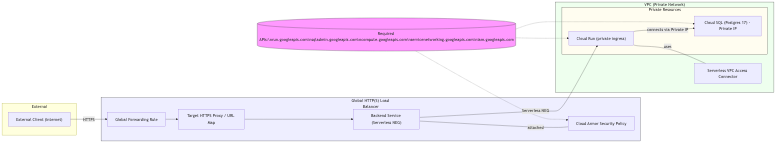

design/architecture.mmd

# Todo App GCP Infrastructure Design — Report

Below is the rendered architecture diagram (generated from design/architecture.mmd).



---

## Summary
This report embeds the architecture PNG generated from the primary Mermaid diagram. It documents the same design decisions and components: Global HTTP(S) Load Balancer with Cloud Armor, Serverless NEG -> Cloud Run (private ingress), Serverless VPC Access Connector, and Cloud SQL (Postgres 17) on Private IP. Required APIs are listed in the design file.

## Mermaid conversion details (footer)
- mmdc command used: npx --yes @mermaid-js/mermaid-cli -i design/architecture.mmd -o artifacts/images/architecture.png --backgroundColor white
- mermaid-cli version (npx):

```
$(cat design/.mmdc_ver.txt)
```

- PNG generation timestamp (UTC):

```
$(cat design/.mmdc_date.txt)
```

- PNG path: artifacts/images/architecture.png

---

## Notes
- If mmdc is not installed globally, the above npx command can be used as an alternative.
- Open Questions from the design are still outstanding and must be answered before Terraform implementation.
