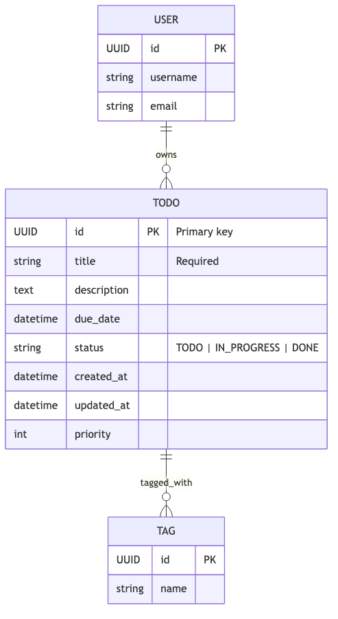
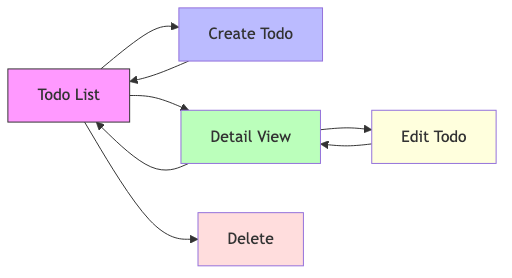
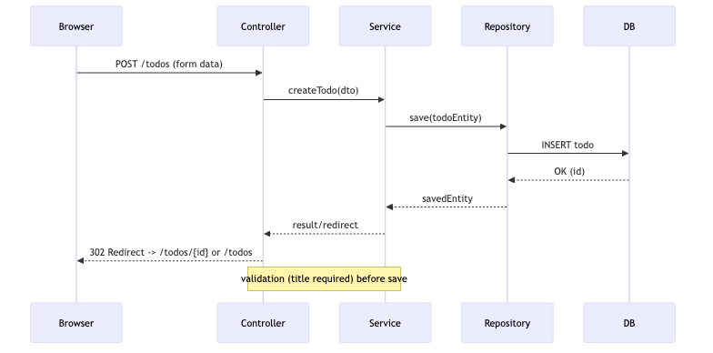

# Todo App — Design Document

## Overview
A simple Spring Boot (Java 17) MVC Todo application. Purpose: manage tasks (create, read, update, delete) with a minimal UI (Thymeleaf + Bootstrap) and PostgreSQL persistence.

Mermaid diagrams:

### ER diagram

*Figure: ER diagram showing the Todo entity (id, title, description, dueDate, status, createdAt, updatedAt, priority) and optional relationships to User and Tag.*

### Screen flow

*Figure: Screen flow showing List → Create → Detail → Edit → Delete pages.*

### Sequence

*Figure: Sequence diagram for creating a Todo (Browser → Controller → Service → Repository → DB).*

## Domain model
Primary entity: Todo
- id: UUID (PK)
- title: String (required)
- description: Text (optional)
- dueDate: Instant/LocalDateTime (optional)
- status: Enum {TODO, IN_PROGRESS, DONE}
- createdAt: Instant
- updatedAt: Instant
- priority: Integer (optional)

Future/optional entities (design notes):
- User (one-to-many Todos)
- Tag (many-to-many with Todo)

See ER diagram: ./diagrams/er-diagram.mmd

## Screens (UI)
1. List view (/todos)
2. Create form (/todos/new)
3. Detail view (/todos/{id})
4. Edit form (/todos/{id}/edit)

See screen flow: ./diagrams/screen-flow.mmd

## Main use case sequence
User creates a Todo (browser → Controller → Service → Repository → DB). See sequence diagram: ./diagrams/sequence.mmd

## API / Endpoints (MVC HTML endpoints)
- GET  /todos           -> list view
- GET  /todos/new       -> form for new Todo
- POST /todos           -> create Todo (form submit)
- GET  /todos/{id}      -> detail view
- GET  /todos/{id}/edit -> edit form
- POST /todos/{id}      -> update Todo (form submit)
- POST /todos/{id}/delete -> delete Todo

(Optionally, a REST API can be added under /api/todos following similar routes.)

## Gradle project configuration (recommended)
- Single-module project under /src-app
- Java toolchain: 17
- Spring Boot: 3.2.4 (recommended example)
- Example dependencies:
  - implementation 'org.springframework.boot:spring-boot-starter-web'
  - implementation 'org.springframework.boot:spring-boot-starter-thymeleaf'
  - implementation 'org.springframework.boot:spring-boot-starter-data-jpa'
  - runtimeOnly 'org.postgresql:postgresql:42.6.0'
  - developmentOnly 'org.springframework.boot:spring-boot-devtools'
  - testImplementation 'org.springframework.boot:spring-boot-starter-test'

Sample build.gradle (high level):

plugins {
    id 'org.springframework.boot' version '3.2.4'
    id 'io.spring.dependency-management' version '1.1.0'
    id 'java'
}

java {
    toolchain {
        languageVersion = JavaLanguageVersion.of(17)
    }
}

dependencies {
    implementation 'org.springframework.boot:spring-boot-starter-web'
    implementation 'org.springframework.boot:spring-boot-starter-thymeleaf'
    implementation 'org.springframework.boot:spring-boot-starter-data-jpa'
    runtimeOnly 'org.postgresql:postgresql:42.6.0'
    developmentOnly 'org.springframework.boot:spring-boot-devtools'
    testImplementation 'org.springframework.boot:spring-boot-starter-test'
}

## application.properties (template)
# JDBC / PostgreSQL example
spring.datasource.url=jdbc:postgresql://localhost:5432/todo_db
spring.datasource.username=todo_user
spring.datasource.password=secret
spring.jpa.hibernate.ddl-auto=update
spring.jpa.show-sql=true

# Server
server.port=8080

## Run / Dev notes
Requirements:
- JDK 17 installed
- Use Gradle Wrapper included in /src-app (./gradlew)

Typical commands (from repo root):
- cd src-app
- ./gradlew bootRun
- ./gradlew build

DB (Docker example):

docker run --name todo-postgres -e POSTGRES_DB=todo_db -e POSTGRES_USER=todo_user -e POSTGRES_PASSWORD=secret -p 5432:5432 -d postgres:15

## Mermaid PNG generation (report step)
If you need PNGs from .mmd files, install mermaid-cli (mmdc):
- npm i -g @mermaid-js/mermaid-cli
- mmdc -i ./docs/diagrams/er-diagram.mmd -o ./docs/diagrams/er-diagram.png

---
Generated artifacts:
- ./docs/app-design.md
- ./docs/diagrams/er-diagram.mmd
- ./docs/diagrams/screen-flow.mmd
- ./docs/diagrams/sequence.mmd

